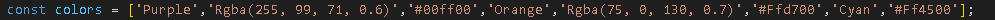
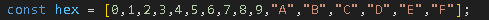
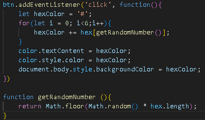

# Color Flipper

Este color Flipper consta de 2 modalidades:

## 1) Simple

En este modo, la aplicación utiliza un conjunto de ocho elementos para seleccionar colores de forma aleatoria.

Este conjunto incluye tres nombres de colores CSS, tres colores hexadecimales y dos valores RGBA.

Al hacer clic en el botón, se muestra un color seleccionado al azar.

## 2) Hex

En esta modalidad, la aplicación utiliza un array de dieciséis elementos que representan dígitos hexadecimales (0-9 y A-F).

Se selecciona un color al azar utilizando un bucle for y una función que genera un número aleatorio entre 0 y la longitud del array.

